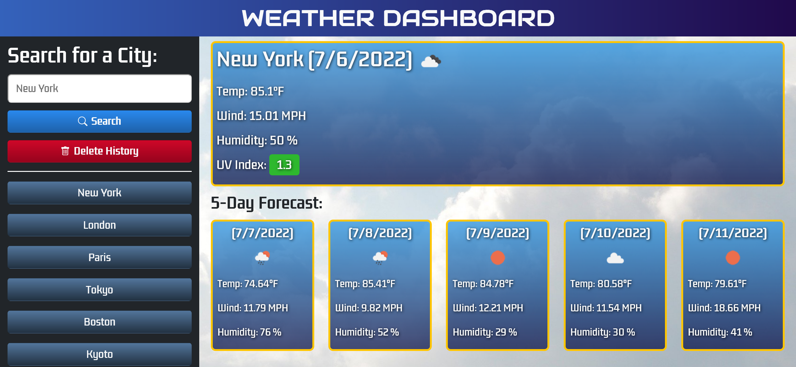

# Weather Dashboard

For this week's challenge, I built a weather dashboard application that utilizes server-side APIs to retrieve weather data for cities. The application features dynamically generated HTML and CSS powered by JavaScript, jQuery, and Bootstrap. A user is able to type in a city's name in the search form, which will be used as a parameter in the request to OpenWeather One Call API. The browser will display the current weather conditions for the city and the 5-day forecast. These conditions include an icon representation of the weather, temperature, wind speed, humidity, and the UV index which will be color coded according to the UV index scale.

- Green: Low (0 to 2)
- Yellow: Moderate (3 to 5)
- Orange: High (6 to 7)
- Red: Very High (8 to 10)
- Violet: Extreme (11+)

In addition, the city will be saved into the browser's local storage and appear in a search history located on the left side of the application. When the user clicks on a city in the search history, that city's data will then be displayed onto the page.

## Screenshot of the completed Weather Dashboard

## Links to GitHub repository and application:

* [Link to GitHub repository](https://github.com/kt946/weather-dashboard)

* [Link to GitHub deployed application](https://kt946.github.io/weather-dashboard/)